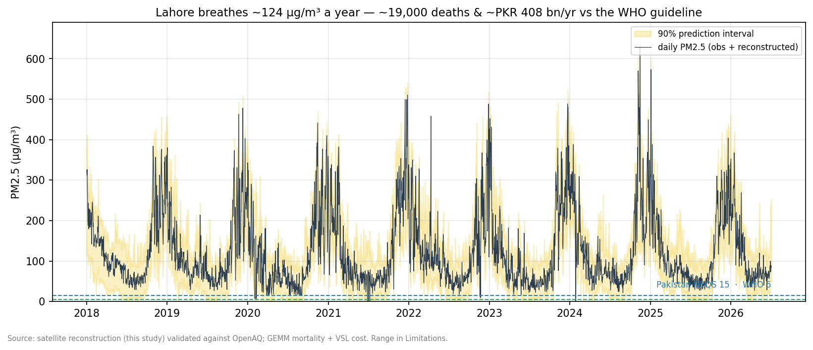

# The Price of Lahore's Air

*A satellite reconstruction of PM2.5 and its human and economic cost.*



> **Lahore breathes ≈124 µg/m³ of PM2.5 a year — about 25× the WHO guideline.
> That pollution is associated with roughly 20,000 premature deaths and ≈PKR
> 400 billion (~USD 1.5 bn) in economic cost per year, valued against the WHO
> guideline. Meeting the guideline would avert almost all of it.**

This project (1) trains a model that predicts daily ground-level PM2.5 for
Lahore from free satellite and weather data, validated against ground monitors
with time-aware cross-validation; (2) reconstructs a continuous daily series;
and (3) translates the pollution into attributable mortality and a rupee cost,
with an interactive scenario tool.

📄 **Article:** *(GitHub Pages URL — publish `site/` with `quarto publish gh-pages`)*
· 🧮 **Live app:** *(Streamlit Community Cloud URL — see `app/README.md`)*

## Headline results

| Metric | Value |
|---|---|
| Annual-mean PM2.5 (2018–2026) | ≈124 µg/m³ |
| Model skill (blocked CV, out-of-fold) | R² 0.72 overall, 0.55 smog season |
| Attributable deaths/yr (vs WHO guideline) | ≈19,700 (range 19,000–36,600) |
| Economic cost/yr | ≈PKR 408 bn / USD 1.5 bn (range PKR 258–2,060 bn) |
| Reconciliation | 12.5% of Pakistan's national GBD PM2.5 deaths, for 4.5% of population |

## How it works

Satellites measure a *column* of aerosol; people breathe the *surface*
concentration. A gradient-boosted model (LightGBM) bridges the two using
Sentinel-5P gases, MODIS MAIAC AOD, ERA5 meteorology (including a physically
motivated AOD ÷ boundary-layer-height feature), and NASA FIRMS fire counts.
Validation is **expanding-window time-series cross-validation** — never random
splits — with metrics reported by season and calibrated 90% prediction
intervals. The reconstructed series feeds a **GEMM** (Burnett et al. 2018)
mortality calculation and a VSL-based economic valuation, all stress-tested in a
sensitivity grid and reconciled against national GBD / World Bank figures.

## Repository layout

```
├── data/            raw (gitignored) · sample (committed, runs the pipeline) · processed (gitignored)
├── src/             01–03 pulls · 04 build · 05 train · 06 reconstruct · 07 cost · 08 maps · utils/
├── notebooks/       01 EDA · 02 modeling · 03 health-cost · 04 viz  (+ build_*.py generators)
├── models/          best_model.pkl, quantile_models.pkl, metrics.json, SHAP, OOF predictions
├── app/             Streamlit scenario app (reads precomputed artifacts only) + app/data/
├── site/            Quarto article → GitHub Pages
└── figures/         presentation-quality exports (+ maps/ GeoTIFFs)
```

## Quickstart

```bash
pip install -r requirements.txt
cp .env.example .env            # fill in keys for a full rebuild (optional)

# Full rebuild from source data (needs API keys):
python src/01_pull_ground_openaq.py     # resumable
python src/02_pull_satellite_gee.py     # resumable
python src/03_pull_fires_firms.py       # resumable
python src/04_build_dataset.py
python src/05_train_model.py
python src/06_reconstruct_series.py
python src/07_health_cost.py
python src/08_export_maps_gee.py

# Or run the modelling half on the committed sample (no keys needed):
python src/04_build_dataset.py --data-dir data/sample --out data/processed

# Explore interactively:
streamlit run app/app.py
```

## Data sources

OpenAQ (US Diplomatic Post Lahore + low-cost network) · Sentinel-5P TROPOMI,
MODIS MCD19A2 MAIAC AOD, ERA5/ERA5-Land via Google Earth Engine · NASA FIRMS ·
WorldPop 2020 · GBD 2023 (IHME) Punjab mortality · GADM 4.1 boundary · Pakistan
NEQS · GEMM (Burnett et al. 2018, PNAS). Reconciliation anchors: World Bank;
GBD 2021 / State of Global Air 2024.

## Honesty & limitations

Single reference monitor (city-level estimate, **no fabricated gridded PM2.5
surface**); largest model error during the extreme smog days that matter most;
coarse, cloud-gapped satellites; contestable CR-function and VSL assumptions
(disclosed as a range, not a point estimate). Full discussion in the article's
Limitations section and in `QA_REPORT.md`.

## License

MIT
